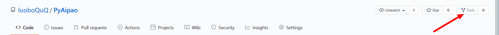
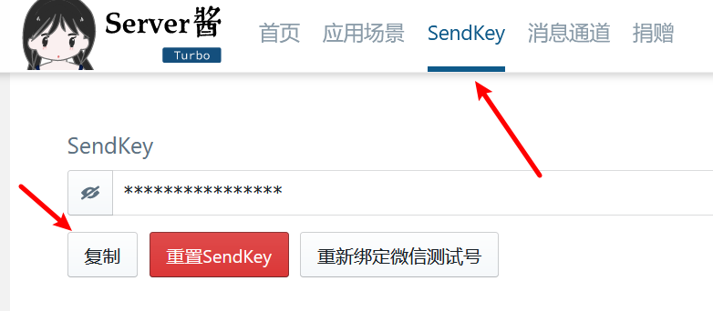
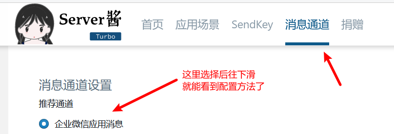
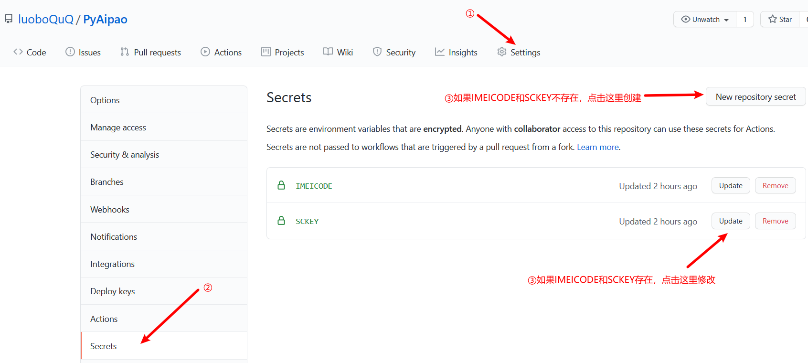
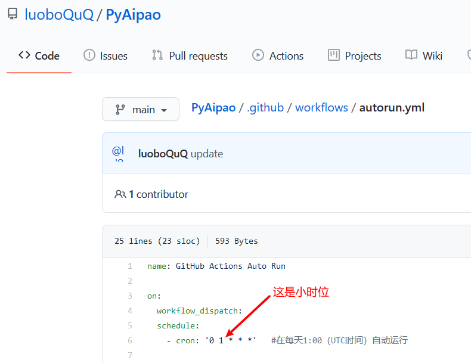
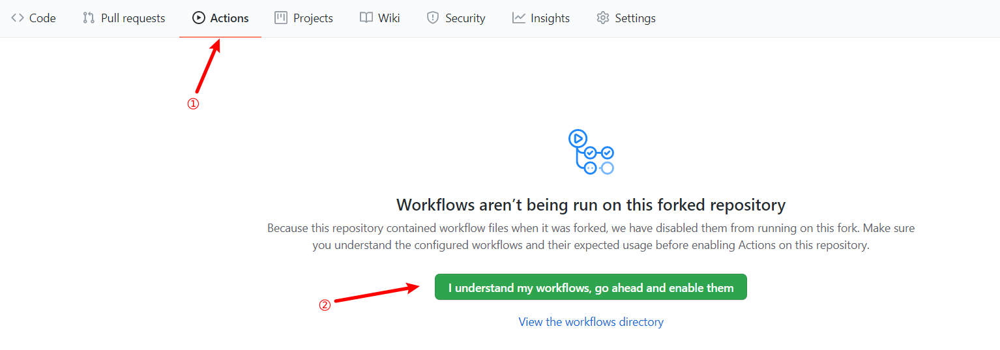
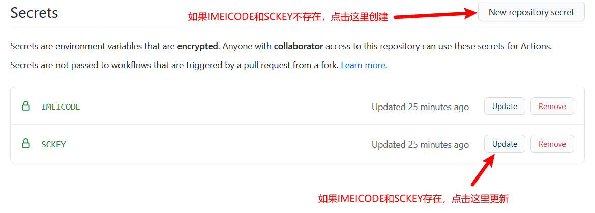
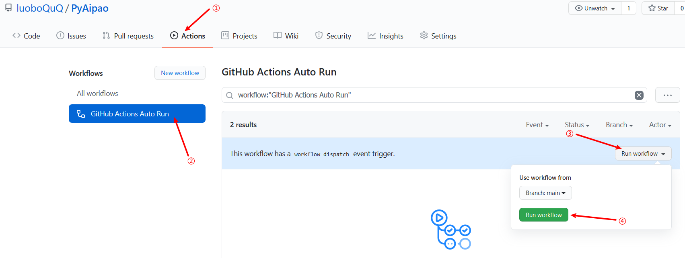
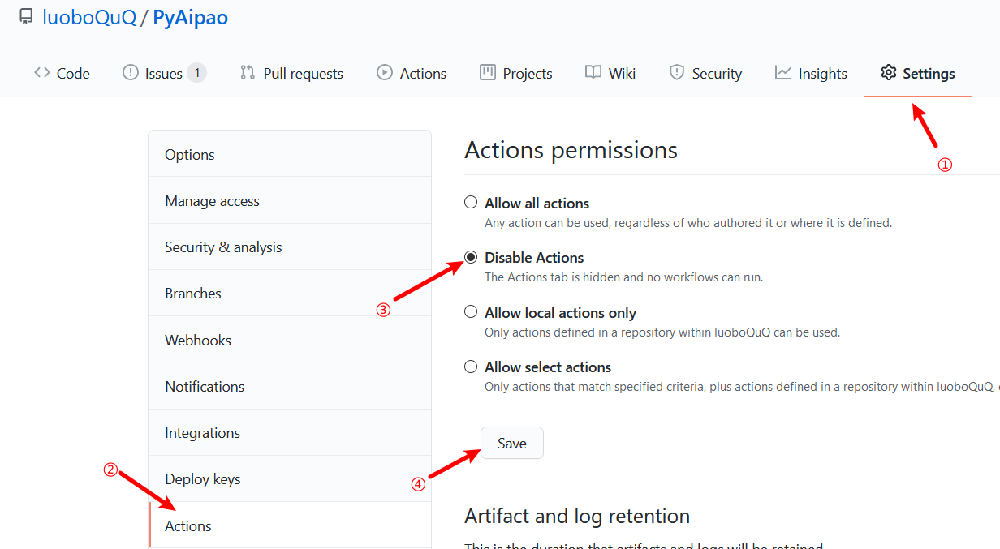

# PyAipao简介
该项目可实现阳光体育一键跑步，同时可基于GitHub Actions来实现云跑步。

仅需一次配置，即可轻松跑完一学期ヾ(≧▽≦*)o

# 准备工作
    1.一个github账号
    2.抓包抓到的IMEICode
    3.Server酱的SCKEY或企业微信（可选，用于微信推送跑步结果）
#  云跑步上手教程

图片加载不出来？[点我](https://luoboquq.gitee.io/p/pyaipao/)

1.点击fork按钮将该仓库复制到你的仓库 

2.获取 IMEICode

- 打开抓包软件抓包, 再打开阳光体育 App 登录, 在所有的数据包中找后缀有 `IMEICode= ` 的 URL 请求, 等号后面的字段即为七天有效的 `IMEICode` (若多次没抓到: 可来回切换几次飞行模式, 杀掉 App 后台重复尝试多次)

**如果不需要推送，可以直接略过第3步**

3.1基于Server酱的推送

- 完成Server酱的注册和绑定 [点我直达](http://sct.ftqq.com)
- 在 [SendKey](https://sct.ftqq.com/sendkey)这一页中找到SendKey并记录

3.2基于企业微信应用消息的推送

由于Server酱不捐助是无法查看消息内容的，所以~~为了白嫖~~我自己写了推送部分的代码，可以直接使用微信官方接口来推送。

企业微信的配置方法可以在Server酱的[消息通道](https://sct.ftqq.com/forward)里看到，这里就不赘述了。

和Server酱一样，我们也需要企业ID(CORPID)，应用ID(AGENTID)，应用Secret(SECRET)这三个值。

4.配置Github Actions

- 打开仓库的`secrets`，在其中建立`IMEICODE`并将IMEICode填入
  

- （可选）使用Server酱推送，需要建立`SCKEY`并填入SendKey

- （可选）使用企业微信应用消息推送，需要建立`CORPID`--填入企业ID，`AGENTID`--填入应用ID，`SECRET`--填入应用Secret

- 打开`Code`-`.github/workflows`-`autorun.yml`，点击右上角的铅笔图标进行编辑，将时间改为你想让它每天按时跑的时间，默认为每天上午9点；同时修改推送方式，默认不推送。

 

**注意**：`autorun.yml`里的时间为UTC时间而不是北京时间 [点我转换](http://www.timebie.com/cn/universalbeijing.php)

- 启用Github Actions

  

到这步已经配置完成了，它每天就会自己跑了。

5.(可选)手动开始跑步

- 如果想手动开始跑步，点击`Actions`，按照图示步骤操作即可。

6.关闭自动跑步

- 在仓库`Settings`-`Actions`中选择`Disable Actions`

  

# 参考链接
- [AutoAction](https://github.com/Saujyun/AutoAction)
- [AiPao](https://github.com/LiaoGuoYin/AiPao)

# 注意事项
**License GPL v3.0**

本文仅供研究，使用者造成的任何后果由使用者自行承担，与作者无关。